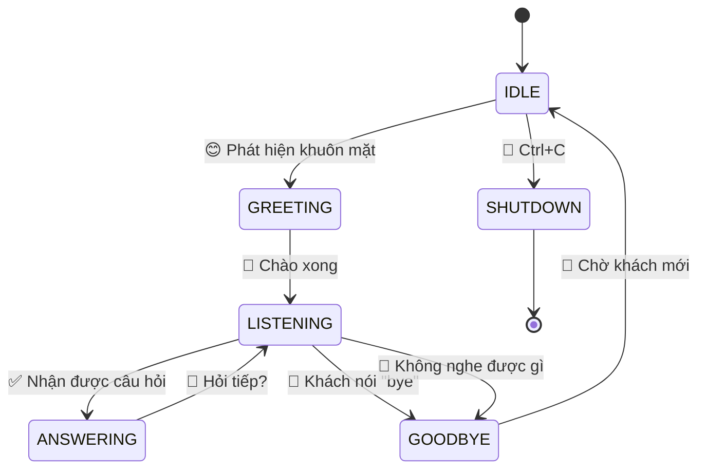
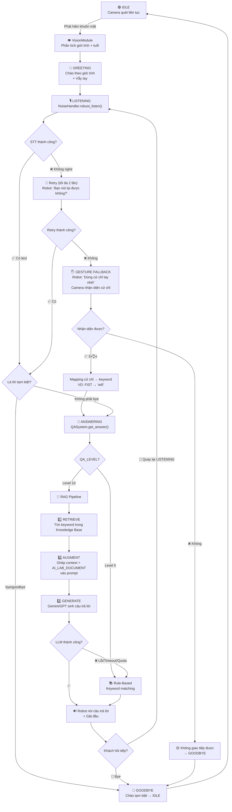
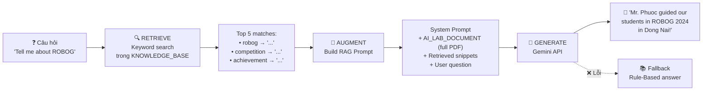
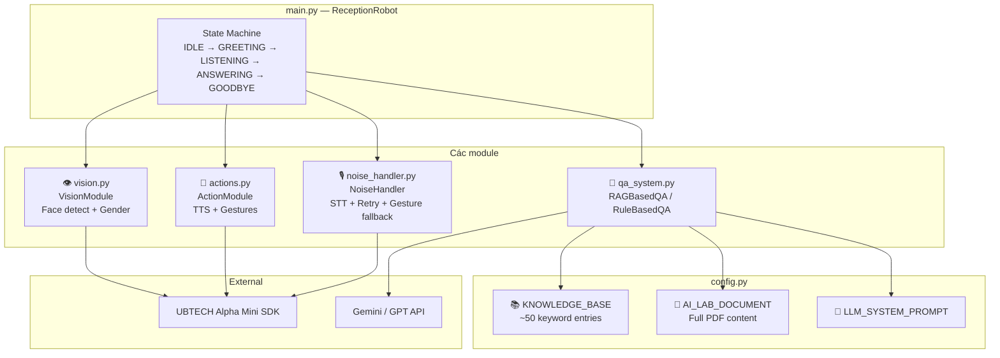
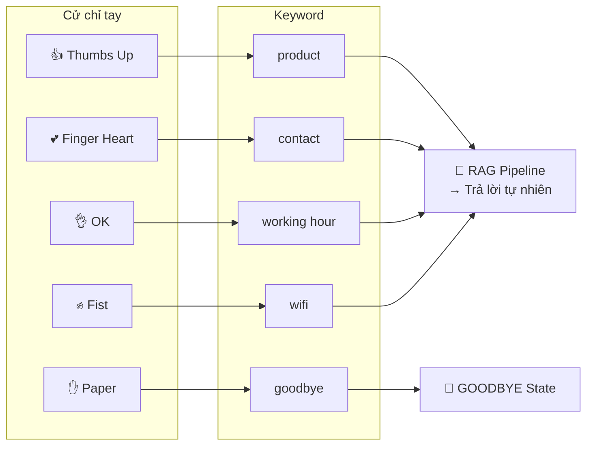

# 🤖 Sơ đồ luồng xử lý — Robot Lễ Tân AI Lab

## 1. State Machine — Vòng đời chính

## 2. Luồng xử lý chính — End to End

## 3. RAG Pipeline — Chi tiết

## 4. Module Architecture

## 5. Gesture Mapping

