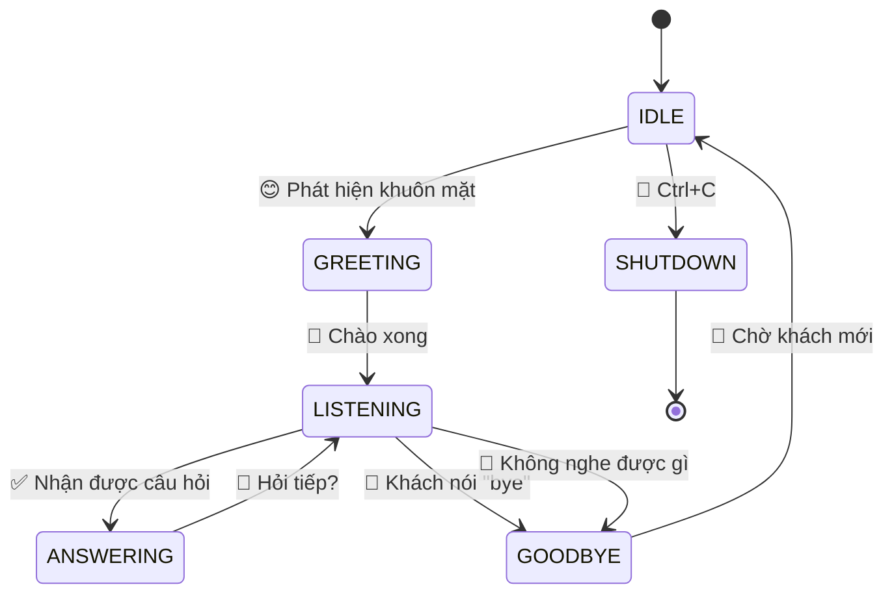
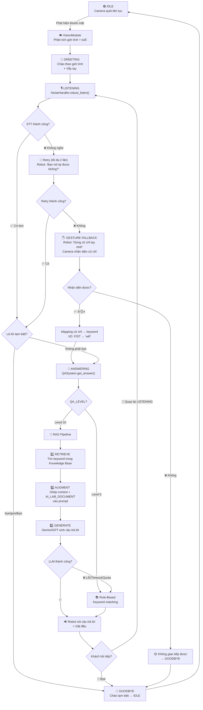
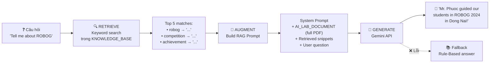
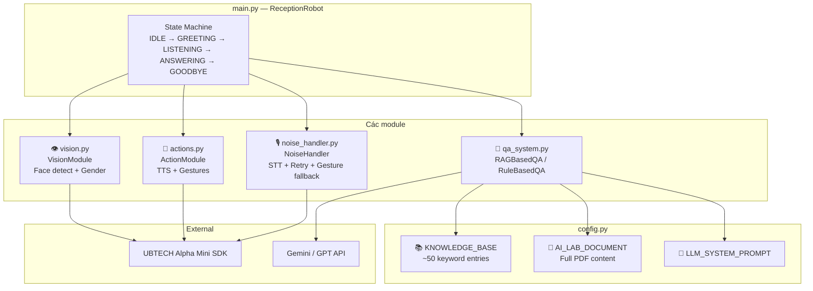
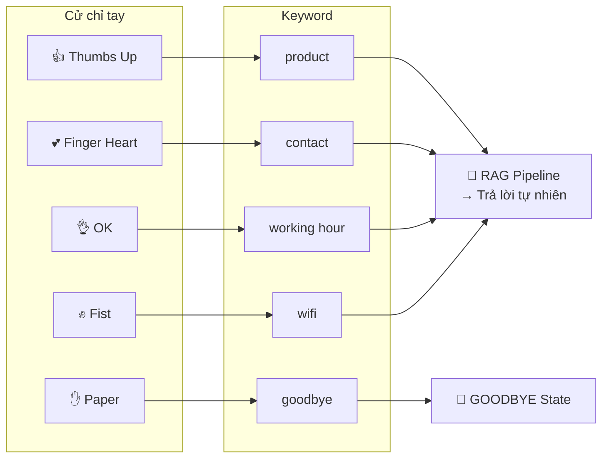
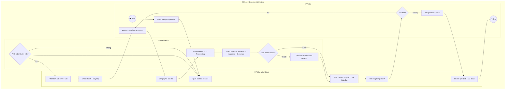

# 🤖 Sơ đồ luồng xử lý — Robot Lễ Tân AI Lab

## 1. State Machine — Vòng đời chính

## 2. Luồng xử lý chính — End to End

## 3. RAG Pipeline — Chi tiết

## 4. Module Architecture

## 5. Gesture Mapping

---

## 6. BPMN — Quy trình tiếp đón khách tổng thể

## 7. BPMN — Quy trình xử lý câu hỏi (RAG Pipeline)

```mermaid
flowchart TD
    subgraph Pool2["🧠 Q&A Processing"]

        subgraph Lane_Input["📥 Input Layer"]
            I1(("⚫ Nhận câu hỏi"))
            I2["Chuẩn hóa text: lowercase + strip"]
            I3{"Câu hỏi rỗng?"}
            I4["Trả default answer"]
        end

        subgraph Lane_Retrieve["🔍 Retrieval Layer"]
            RE1["Duyệt tất cả keyword trong Knowledge Base"]
            RE2{"Tìm thấy keyword match?"}
            RE3["Sắp xếp: dài nhất trước"]
            RE4["Lấy top-5 relevant entries"]
            RE5["Không có context bổ sung"]
        end

        subgraph Lane_Augment["📝 Augmentation Layer"]
            AU1["Lấy System Prompt"]
            AU2["Lấy AI_LAB_DOCUMENT: toàn bộ PDF"]
            AU3["Ghép: Prompt + Document + Retrieved chunks + Question"]
        end

        subgraph Lane_Generate["🤖 Generation Layer"]
            G1{"Provider?"}
            G2["Gọi Gemini API"]
            G3["Gọi OpenAI API"]
            G4{"Response OK?"}
            G5["Trả câu trả lời tự nhiên"]
            G6(("⭕ Done"))
        end

        subgraph Lane_Fallback["🔄 Fallback Layer"]
            F1{"Loại lỗi?"}
            F2["429 / RESOURCE_EXHAUSTED: Cooldown 120s"]
            F3["Timeout / Other error"]
            F4["Rule-Based: keyword matching"]
        end
    end

    I1 --> I2 --> I3
    I3 -->|Có| I4 --> G6
    I3 -->|Không| RE1

    RE1 --> RE2
    RE2 -->|Có| RE3 --> RE4
    RE2 -->|Không| RE5

    RE4 --> AU1
    RE5 --> AU1
    AU1 --> AU2 --> AU3

    AU3 --> G1
    G1 -->|Gemini| G2
    G1 -->|OpenAI| G3
    G2 --> G4
    G3 --> G4

    G4 -->|✅ Thành công| G5 --> G6
    G4 -->|❌ Lỗi| F1
    F1 -->|Quota hết| F2 --> F4
    F1 -->|Timeout / Lỗi khác| F3 --> F4
    F4 --> G5
```

## 8. BPMN — Quy trình xử lý tiếng ồn (Noise Handling)

```mermaid
flowchart TD
    subgraph Pool3["🎙️ Noise Handling Process"]

        subgraph Lane_STT["🔊 Speech-to-Text"]
            S1(("⚫ Start Listen"))
            S2["Mute robot speaker"]
            S3{"Chế độ STT?"}
            S4["Robot mic: Record audio"]
            S5["Download audio từ robot"]
            S6["Google STT API"]
            S7["Robot built-in STT: English"]
            S8["Unmute robot speaker"]
            S9{"Nhận diện được text?"}
        end

        subgraph Lane_Retry["🔄 Retry"]
            RT1{"Còn lượt retry?<br/>Max: 2 lần"}
            RT2["Robot nói: 'Could you say it again?'"]
            RT3["Robot lắc đầu"]
            RT4["Tăng timeout: 15s"]
        end

        subgraph Lane_Gesture["🖐️ Gesture Fallback"]
            GE1["Robot nói: 'Use hand gestures!'"]
            GE2["Robot chuyển tư thế lắng nghe"]
            GE3["Camera: ObjectRecognise GESTURE"]
            GE4{"Nhận diện cử chỉ?"}
            GE5["Mapping: Gesture → Keyword"]
            GE6["Robot: 'Got it! You want to know about ...'"]
            GE7["Không giao tiếp được"]
            GE8["Robot: 'Please try again later!'"]
        end

        subgraph Lane_Output["📤 Output"]
            O1["Trả về text cho QA System"]
            O2["Trả về None"]
            O3(("⭕ End"))
        end
    end

    S1 --> S2 --> S3
    S3 -->|LOCAL| S4 --> S5 --> S6 --> S8
    S3 -->|ROBOT| S7 --> S8
    S8 --> S9

    S9 -->|✅ Có text| O1 --> O3
    S9 -->|❌ Không| RT1

    RT1 -->|Còn| RT2 --> RT3 --> RT4 --> S2
    RT1 -->|Hết lượt| GE1

    GE1 --> GE2 --> GE3 --> GE4
    GE4 -->|✅ Nhận diện được| GE5 --> GE6 --> O1
    GE4 -->|❌ Không| GE7 --> GE8 --> O2 --> O3
```

