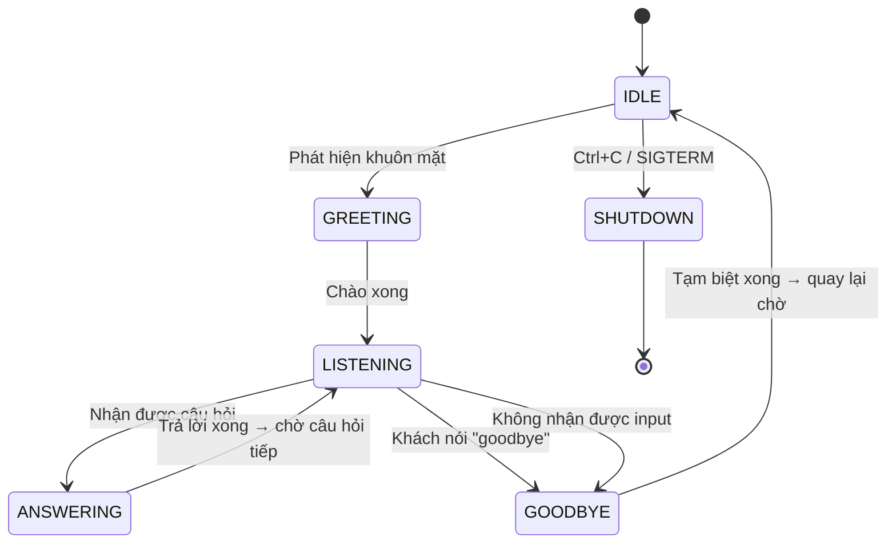
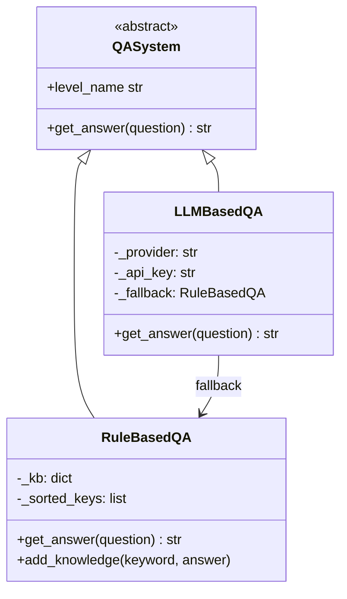
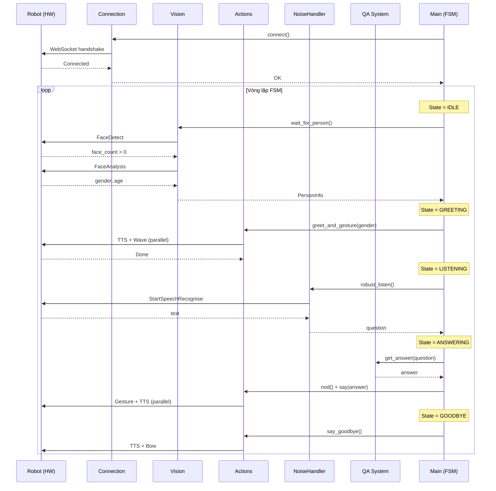
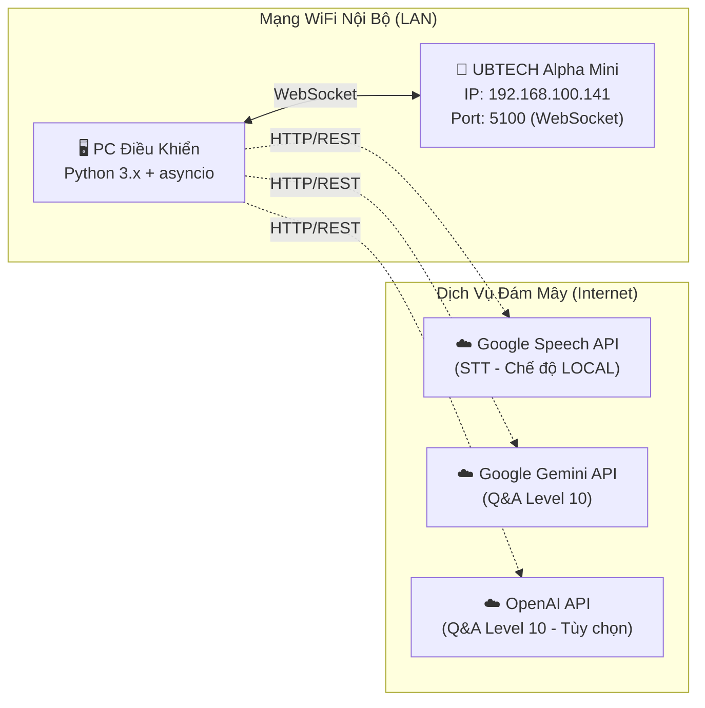
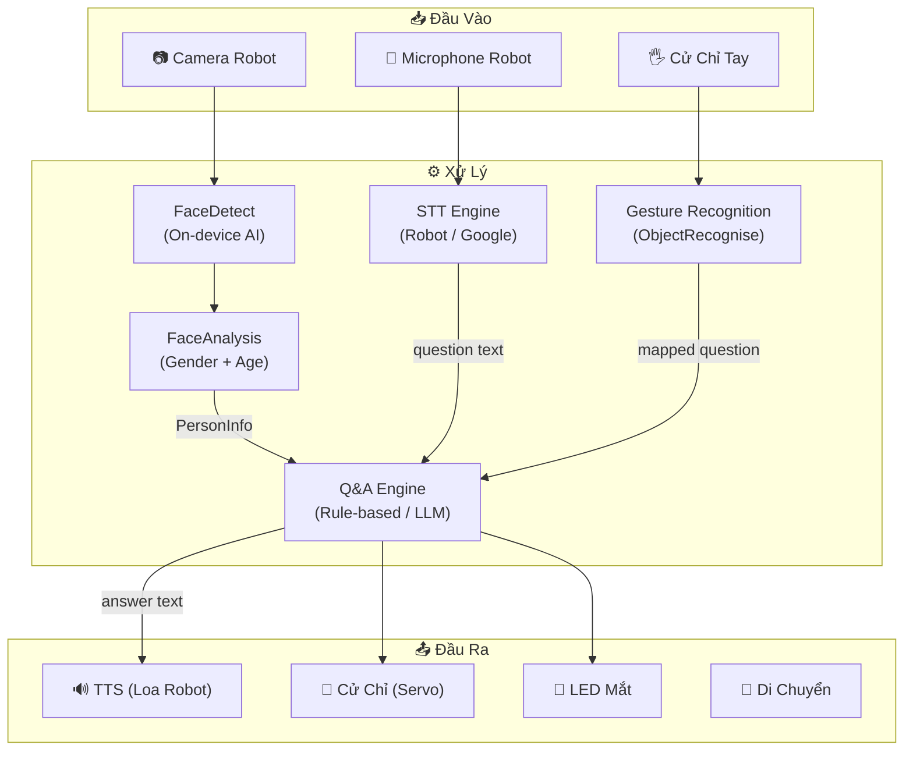

# Báo Cáo Hệ Thống Robot Lễ Tân Thông Minh

> **Tài liệu kỹ thuật — Tuân thủ chuẩn IEEE 1016-2009 (Software Design Description)**

---

## 1. Giới Thiệu

### 1.1. Mục đích tài liệu

Tài liệu này mô tả thiết kế hệ thống phần mềm điều khiển **Robot Lễ Tân Thông Minh** (Smart Receptionist Robot), xây dựng trên nền tảng phần cứng **UBTECH Alpha Mini**. Nội dung bao gồm kiến trúc tổng thể, sơ đồ khối xử lý, nguyên lý hoạt động, và chức năng chi tiết của từng module.

### 1.2. Phạm vi hệ thống

- **Tên hệ thống:** Robot Lễ Tân Phòng Lab (Lab Receptionist Robot)
- **Nền tảng phần cứng:** UBTECH Alpha Mini (Education Edition — DEDU)
- **Ngôn ngữ lập trình:** Python 3.x (asyncio-based)
- **Giao thức truyền thông:** WebSocket (SDK alphamini)
- **Ngôn ngữ giao tiếp:** Tiếng Anh (English)

### 1.3. Các thuật ngữ và viết tắt

| Viết tắt | Ý nghĩa |
|----------|---------|
| STT | Speech-to-Text (Nhận dạng giọng nói) |
| TTS | Text-to-Speech (Tổng hợp giọng nói) |
| LLM | Large Language Model (Mô hình ngôn ngữ lớn) |
| Q&A | Question and Answer (Hỏi đáp) |
| SDK | Software Development Kit |
| FSM | Finite State Machine (Máy trạng thái hữu hạn) |

---

## 2. Tổng Quan Kiến Trúc Hệ Thống

### 2.1. Mô hình kiến trúc

Hệ thống được thiết kế theo mô hình **kiến trúc module hóa (Modular Architecture)**, trong đó mỗi chức năng được đóng gói trong một module độc lập. Một bộ điều phối trung tâm (orchestrator) quản lý luồng hoạt động thông qua **Máy Trạng Thái Hữu Hạn (FSM)**.

### 2.2. Sơ đồ khối tổng thể

```
┌─────────────────────────────────────────────────────────┐
│                   MAIN ORCHESTRATOR                     │
│                  (ReceptionRobot — FSM)                  │
│                      [main.py]                          │
├─────────┬───────────┬────────────┬──────────────────────┤
│         │           │            │                      │
│    ┌────▼────┐ ┌────▼─────┐ ┌───▼────┐ ┌──────────────┐│
│    │ VISION  │ │ ACTIONS  │ │   Q&A  │ │NOISE HANDLER ││
│    │ MODULE  │ │ MODULE   │ │ SYSTEM │ │   MODULE     ││
│    │[vision] │ │[actions] │ │ [qa]   │ │[noise_handler│|
│    └────┬────┘ └────┬─────┘ └───┬────┘ └──────┬───────┘│
│         │           │           │              │        │
├─────────┴───────────┴───────────┴──────────────┴────────┤
│              CONNECTION MODULE [connection.py]           │
│            (WebSocket — UBTECH Alpha Mini SDK)           │
├─────────────────────────────────────────────────────────┤
│              CONFIG MODULE [config.py]                   │
│     (Constants, Knowledge Base, Environment Vars)        │
└─────────────────────────────────────────────────────────┘
                          │
                    ┌─────▼─────┐
                    │  UBTECH   │
                    │ ALPHA MINI│
                    │  (Robot)  │
                    └───────────┘
```

### 2.3. Danh sách các module

| Module | File | Chức năng chính |
|--------|------|----------------|
| Main Orchestrator | `main.py` | Điều phối toàn bộ hệ thống qua FSM |
| Connection | `connection.py` | Quản lý kết nối WebSocket tới robot |
| Vision | `vision.py` | Phát hiện khuôn mặt, phân tích giới tính và tuổi |
| Actions | `actions.py` | TTS, cử chỉ, di chuyển, biểu cảm |
| Q&A System | `qa_system.py` | Hỏi đáp Rule-based (L5) và LLM (L10) |
| Noise Handler | `noise_handler.py` | Xử lý nhận dạng giọng nói trong môi trường nhiễu |
| Config | `config.py` | Cấu hình tập trung, knowledge base, templates |

---

## 3. Sơ Đồ Khối Xử Lý — Máy Trạng Thái (FSM)

### 3.1. Biểu đồ trạng thái



### 3.2. Mô tả các trạng thái

| Trạng thái | Mô tả | Module liên quan |
|------------|--------|-----------------|
| **IDLE** | Robot chờ, quét camera liên tục để phát hiện khách | VisionModule |
| **GREETING** | Chào khách theo giới tính (TTS + vẫy tay đồng thời) | ActionModule, VisionModule |
| **LISTENING** | Lắng nghe câu hỏi từ khách (STT + fallback gesture) | NoiseHandler |
| **ANSWERING** | Xử lý câu hỏi qua Q&A engine, phát câu trả lời | QASystem, ActionModule |
| **GOODBYE** | Tạm biệt khách, reset session | ActionModule |
| **SHUTDOWN** | Tắt hệ thống an toàn | Connection |

---

## 4. Nguyên Lý Hoạt Động

### 4.1. Luồng xử lý chính

```
[Khởi động] → [Kết nối Robot] → [Khởi tạo Modules]
     │
     ▼
┌──────────┐
│   IDLE   │◄──────────────────────────────────┐
│ Quét     │                                    │
│ camera   │                                    │
└────┬─────┘                                    │
     │ Phát hiện khuôn mặt                      │
     ▼                                          │
┌──────────┐                                    │
│ GREETING │                                    │
│ Chào     │                                    │
│ khách    │                                    │
└────┬─────┘                                    │
     │                                          │
     ▼                                          │
┌──────────┐    Có câu hỏi    ┌──────────┐     │
│LISTENING │─────────────────▶│ANSWERING │     │
│ Lắng     │                  │ Trả lời  │     │
│ nghe     │◄─────────────────│ Q&A      │     │
└────┬─────┘  Trả lời xong   └──────────┘     │
     │                                          │
     │ Goodbye / Timeout                        │
     ▼                                          │
┌──────────┐                                    │
│ GOODBYE  │────────────────────────────────────┘
│ Tạm biệt│
└──────────┘
```

### 4.2. Nguyên lý hoạt động từng giai đoạn

#### 4.2.1. Giai đoạn khởi động

1. Hệ thống đọc cấu hình từ file `.env` và `config.py`
2. Thiết lập kết nối WebSocket tới robot Alpha Mini qua `RobotConnection`
3. Khởi tạo tất cả sub-module: Vision, Actions, Q&A, NoiseHandler
4. Robot phát thông báo sẵn sàng qua TTS
5. Bắt đầu vòng lặp FSM

#### 4.2.2. Giai đoạn phát hiện khách (IDLE)

- Camera robot quét liên tục với chu kỳ `PERSON_POLL_INTERVAL` (mặc định 3 giây)
- Sử dụng SDK `FaceDetect` để phát hiện khuôn mặt
- Khi phát hiện khuôn mặt, gọi `FaceAnalysis` để xác định giới tính và tuổi
- Ngưỡng giới tính: `gender_score < 50` → Nữ, `≥ 50` → Nam

#### 4.2.3. Giai đoạn chào khách (GREETING)

- Chọn mẫu câu chào ngẫu nhiên dựa trên giới tính (`male`/`female`/`unknown`)
- Thực hiện **đồng thời** TTS và cử chỉ vẫy tay qua `asyncio.gather()`
- Đảm bảo trải nghiệm tự nhiên nhờ song song hóa hành động

#### 4.2.4. Giai đoạn lắng nghe (LISTENING)

- Sử dụng `NoiseHandler.robust_listen()` với chiến lược 3 lớp:
  - **Lớp 1:** Nhận dạng giọng nói (timeout 10s)
  - **Lớp 2:** Thử lại tối đa 2 lần (timeout mở rộng 15s)
  - **Lớp 3:** Fallback sang nhận dạng cử chỉ tay
- Lọc nhiễu: bỏ qua các fragment ngắn (< 2 từ)
- Phát hiện keyword tạm biệt để chuyển sang GOODBYE

#### 4.2.5. Giai đoạn trả lời (ANSWERING)

- Gửi câu hỏi tới Q&A engine (Rule-based hoặc LLM)
- Cắt câu trả lời nếu vượt quá 220 ký tự (giới hạn TTS robot)
- Robot **gật đầu + phát TTS đồng thời** qua `asyncio.gather()`
- Quay lại LISTENING để chờ câu hỏi tiếp theo

#### 4.2.6. Giai đoạn tạm biệt (GOODBYE)

- Phát câu tạm biệt ngẫu nhiên + cử chỉ cúi chào
- Reset thông tin session (person, question)
- Chờ 3 giây rồi quay lại IDLE

---

## 5. Chi Tiết Từng Khối Module

### 5.1. Connection Module (`connection.py`)

#### Chức năng

Quản lý toàn bộ lifecycle kết nối WebSocket giữa PC và robot Alpha Mini.

#### Thành phần

- **MockDevice:** Wrapper object mô phỏng cấu trúc `WiFiDevice` mà SDK yêu cầu (address, name, port)
- **RobotConnection:** Class chính quản lý kết nối

#### Các tính năng

- **Retry logic:** Thử kết nối tối đa 3 lần, mỗi lần cách nhau 2 giây
- **Context Manager:** Hỗ trợ `async with` cho quản lý tài nguyên tự động
- **Volume control:** Thiết lập âm lượng, mute/unmute (dùng khi ghi âm)
- **Language setting:** Đặt ngôn ngữ STT/TTS cho robot
- **Program mode:** Vào/thoát chế độ lập trình robot

#### Giao diện API

| Method | Mô tả |
|--------|--------|
| `connect()` | Kết nối tới robot với retry |
| `disconnect()` | Ngắt kết nối, giải phóng tài nguyên |
| `mute()` / `unmute()` | Tắt/bật âm thanh robot |
| `set_language()` | Đặt ngôn ngữ STT/TTS |
| `enter_program_mode()` | Vào chế độ lập trình |

---

### 5.2. Vision Module (`vision.py`)

#### Chức năng

Phát hiện người và phân tích đặc điểm khuôn mặt (giới tính, tuổi) thông qua camera và AI trên robot.

#### Kiến trúc xử lý

```
Camera Robot → FaceDetect API → Có người?
                                   │
                          ┌────────┴────────┐
                          │ Có              │ Không
                          ▼                  ▼
                   FaceAnalysis API     Chờ & quét lại
                          │
                          ▼
                   PersonInfo(gender, age, face_size)
```

#### Data class `PersonInfo`

| Thuộc tính | Kiểu | Mô tả |
|-----------|------|--------|
| `detected` | bool | Đã phát hiện người hay chưa |
| `gender` | str | `"male"` / `"female"` / `"unknown"` |
| `gender_score` | int | Điểm giới tính [0–100] |
| `age` | int | Tuổi ước lượng |
| `face_count` | int | Số khuôn mặt phát hiện được |

#### Đặc điểm kỹ thuật

- Toàn bộ xử lý AI chạy **trực tiếp trên robot** (on-device), không cần gửi ảnh về PC
- Khi phát hiện nhiều người, ưu tiên khuôn mặt lớn nhất (gần camera nhất)
- Hỗ trợ chụp ảnh qua `take_photo()`

---

### 5.3. Actions Module (`actions.py`)

#### Chức năng

Điều khiển mọi hành động vật lý của robot: phát giọng nói, cử chỉ, di chuyển, biểu cảm mắt.

#### Phân loại hành động

| Loại | Hành động | Mô tả |
|------|----------|--------|
| **TTS** | `say()` | Phát giọng nói từ văn bản |
| **Gesture** | `wave_hand()` | Vẫy tay chào |
| | `nod()` | Gật đầu (đồng ý) |
| | `shake_head()` | Lắc đầu |
| | `bow()` | Cúi chào |
| | `listen_pose()` | Tư thế lắng nghe |
| | `dance()` | Nhảy múa |
| **Movement** | `move_forward()` | Di chuyển tiến |
| | `move_backward()` | Di chuyển lùi |
| **Expression** | `show_expression()` | Hiệu ứng mắt robot |
| **Composite** | `greet_and_gesture()` | TTS + vẫy tay đồng thời |
| | `say_goodbye()` | TTS tạm biệt + cúi chào |

#### Kỹ thuật song song hóa

Sử dụng `asyncio.gather()` để chạy đồng thời nhiều hành động, tạo trải nghiệm tự nhiên hơn. Ví dụ: robot vừa nói vừa vẫy tay cùng lúc.

---

### 5.4. Q&A System Module (`qa_system.py`)

#### Chức năng

Hệ thống hỏi đáp 2 cấp độ, xử lý câu hỏi từ khách và sinh câu trả lời.

#### Kiến trúc



#### Level 5 — Rule-Based Q&A

- **Thuật toán:** Keyword matching với ưu tiên longest-match
- **Cơ sở tri thức:** 30+ mục bao gồm thông tin lab, sản phẩm, WiFi, giờ làm việc, liên hệ
- **Ưu điểm:** Phản hồi nhanh, không cần internet, dễ tùy chỉnh
- **Nhược điểm:** Không hiểu ngữ cảnh, chỉ trả lời pattern đã định trước

#### Level 10 — LLM-Based Q&A

- **Provider hỗ trợ:** OpenAI (GPT-4o-mini), Google Gemini
- **System prompt:** Giới hạn câu trả lời ngắn gọn (1–2 câu, < 150 ký tự)
- **Cơ chế fallback:** Khi LLM lỗi/timeout → tự động chuyển về Rule-Based
- **Quota cooldown:** Khi bị rate-limit (HTTP 429), tạm dừng gọi API trong 120 giây
- **Ưu điểm:** Hiểu ngữ cảnh, trả lời linh hoạt
- **Nhược điểm:** Cần internet, có độ trễ 1–3 giây, tốn chi phí API

#### Factory pattern

Hàm `create_qa_system(level)` tạo instance phù hợp dựa trên tham số cấu hình.

---

### 5.5. Noise Handler Module (`noise_handler.py`)

#### Chức năng

Xử lý nhận dạng giọng nói trong môi trường nhiễu, với chiến lược fallback đa lớp.

#### Hai chế độ STT

| Chế độ | Điều kiện | Luồng xử lý |
|--------|----------|-------------|
| **LOCAL** | `USE_LOCAL_STT=True` | Mic robot → Ghi âm → Tải về PC → Google STT |
| **ROBOT** | `USE_LOCAL_STT=False` | Mic robot → STT nội bộ (English) |

#### Chiến lược xử lý nhiễu (Robust Listen)

```
┌─────────────────────┐
│ 1. single_listen()  │ ── Thành công ──▶ Trả về text
│    (timeout 10s)    │
└─────────┬───────────┘
          │ Thất bại
          ▼
┌─────────────────────┐
│ 2. Retry (tối đa 2 │ ── Thành công ──▶ Trả về text
│    lần, timeout 15s)│
│    Robot: "Xin lỗi, │
│    bạn nói lại..."  │
└─────────┬───────────┘
          │ Thất bại
          ▼
┌─────────────────────┐
│ 3. Gesture fallback │ ── Nhận dạng ──▶ Map gesture
│    Nhận dạng cử chỉ │                   thành câu hỏi
│    tay (timeout 15s)│
└─────────┬───────────┘
          │ Thất bại
          ▼
     Trả về None
```

#### Gesture mapping

| Cử chỉ tay | Câu hỏi được map |
|------------|------------------|
| THUMBS_UP | Sản phẩm (product) |
| FINGER_HEART | Liên hệ (contact) |
| OK | Giờ làm việc (working hour) |
| PAPER | Tạm biệt (goodbye) |
| FIST | WiFi |

#### Kỹ thuật Mute/Unmute

Trước khi lắng nghe, robot được **mute** để tránh phát thông báo "I didn't hear your voice" gây nhiễu micro. Sau khi ghi âm xong, **unmute** để phục hồi âm lượng.

---

### 5.6. Config Module (`config.py`)

#### Chức năng

Tập trung toàn bộ hằng số cấu hình, template câu chào, knowledge base, và system prompt cho LLM.

#### Các nhóm cấu hình

| Nhóm | Các tham số chính |
|------|------------------|
| **Robot Connection** | `ROBOT_IP`, `ROBOT_PORT`, `CONNECTION_RETRY` |
| **Vision** | `FACE_DETECT_TIMEOUT`, `GENDER_THRESHOLD` |
| **Speech** | `LISTEN_TIMEOUT_MS`, `MAX_RETRY_LISTEN` |
| **Q&A** | `QA_LEVEL`, `LLM_PROVIDER`, `LLM_API_KEY` |
| **Templates** | `GREETINGS`, `GOODBYE_MESSAGES`, `NOISE_RETRY_MESSAGES` |
| **Knowledge Base** | `KNOWLEDGE_BASE` (30+ entries) |
| **Gesture** | `GESTURE_TO_QUESTION`, `GESTURE_WAVE`, `GESTURE_NOD` |
| **Logging** | `LOG_LEVEL`, `LOG_FORMAT` |

---

## 6. Sơ Đồ Tương Tác Giữa Các Module

### 6.1. Sequence Diagram — Luồng tiếp khách hoàn chỉnh



---

## 7. Yêu Cầu Phần Cứng và Phần Mềm

### 7.1. Phần cứng

- **Robot:** UBTECH Alpha Mini (Education Edition — DEDU)
  - Camera tích hợp (nhận dạng khuôn mặt on-device)
  - Microphone tích hợp
  - Loa tích hợp (TTS)
  - Servo motors (cử chỉ, di chuyển)
  - Màn hình LED mắt (biểu cảm)
- **PC điều khiển:** Máy tính chạy Python, kết nối cùng mạng WiFi với robot

### 7.2. Phần mềm và thư viện

| Thư viện | Phiên bản | Chức năng |
|----------|----------|-----------|
| `alphamini` | Latest | SDK điều khiển robot |
| `websockets` | 10.4 | Kết nối WebSocket |
| `SpeechRecognition` | Latest | Google STT (chế độ LOCAL) |
| `openai` | ≥ 1.0 | OpenAI GPT API |
| `google-generativeai` | ≥ 0.3 | Google Gemini API |
| `python-dotenv` | ≥ 1.0 | Đọc biến môi trường từ `.env` |

---

## 8. Xử Lý Lỗi và Khả Năng Phục Hồi

### 8.1. Chiến lược xử lý lỗi

| Tình huống | Cơ chế xử lý |
|-----------|--------------|
| Kết nối robot thất bại | Retry tối đa 3 lần, delay 2s giữa mỗi lần |
| STT không nhận dạng được | Retry 2 lần → Fallback gesture |
| LLM API timeout | Fallback về Rule-Based Q&A |
| LLM quota exhausted (429) | Cooldown 120s → tự động dùng Rule-Based |
| Lỗi bất kỳ trong FSM | Log lỗi, reset về trạng thái IDLE |
| Tín hiệu SIGINT/SIGTERM | Graceful shutdown: phát TTS tạm biệt → ngắt kết nối |

### 8.2. Tính sẵn sàng cao

- Hệ thống **không bao giờ crash hoàn toàn** nhờ try-except bao quanh mọi state handler
- Mọi lỗi đều được ghi log chi tiết với timestamp
- FSM tự động phục hồi về IDLE khi gặp exception

---

## 9. Sơ Đồ Triển Khai Vật Lý

### 9.1. Mô hình triển khai



### 9.2. Yêu cầu mạng

| Thành phần | Giao thức | Port | Bắt buộc |
|-----------|----------|------|---------|
| PC ↔ Robot | WebSocket | 5100 | ✅ Có |
| Robot Audio Download | HTTP | 9000/9090/8008 | Chỉ chế độ LOCAL STT |
| Google STT API | HTTPS | 443 | Chỉ chế độ LOCAL STT |
| Gemini / OpenAI API | HTTPS | 443 | Chỉ Q&A Level 10 |

> [!IMPORTANT]
> PC và Robot **bắt buộc** phải kết nối cùng một mạng WiFi nội bộ. Kết nối internet chỉ cần thiết khi sử dụng chế độ LOCAL STT hoặc Q&A Level 10 (LLM).

---

## 10. Luồng Dữ Liệu (Data Flow)

### 10.1. Sơ đồ luồng dữ liệu tổng thể



### 10.2. Luồng dữ liệu STT chi tiết

#### Chế độ ROBOT (mặc định)

```
Giọng nói → Mic Robot → STT nội bộ (English) → Text
```

- Độ trễ: **< 1 giây**
- Không cần internet
- Chỉ hỗ trợ tiếng Anh

#### Chế độ LOCAL

```
Giọng nói → Mic Robot → Ghi âm WAV → HTTP Download về PC
→ Google Speech API → Text
```

- Độ trễ: **2–5 giây**
- Cần internet
- Hỗ trợ đa ngôn ngữ (vi-VN, en-US, zh-CN, ...)

---

## 11. Bảo Mật và An Toàn

### 11.1. Quản lý thông tin nhạy cảm

| Thông tin | Phương pháp bảo vệ |
|----------|-------------------|
| API Key (LLM) | Lưu trong file `.env`, không commit vào Git |
| Mật khẩu WiFi Lab | Chỉ cung cấp khi khách hỏi, không hiển thị trên giao diện |
| Thông tin liên hệ | Nằm trong knowledge base cục bộ, không gửi ra ngoài ở Level 5 |

### 11.2. Bảo mật mạng

- Giao tiếp PC ↔ Robot qua **mạng nội bộ** (không qua internet)
- API key được đọc từ biến môi trường, không hard-code trong source code
- File `.env.example` chỉ chứa placeholder, không chứa giá trị thật

### 11.3. Bảo mật dữ liệu người dùng

- Hệ thống **không lưu trữ** thông tin cá nhân của khách (khuôn mặt, giọng nói)
- Dữ liệu `PersonInfo` chỉ tồn tại trong bộ nhớ RAM trong phiên làm việc
- Khi chuyển sang GOODBYE, toàn bộ thông tin session được **xóa sạch** (`_current_person = None`)
- File âm thanh tạm thời (chế độ LOCAL STT) được xóa ngay sau khi xử lý (`os.unlink()`)

---

## 12. Hướng Dẫn Triển Khai

### 12.1. Cài đặt môi trường

```bash
# 1. Clone repository
git clone <repo-url>
cd Robot-letan

# 2. Tạo virtual environment
python -m venv .venv
source .venv/bin/activate  # Linux/macOS

# 3. Cài đặt dependencies
pip install -r requirements.txt

# 4. Cấu hình môi trường
cp .env.example .env
# Chỉnh sửa .env: đặt ROBOT_IP, LLM_API_KEY, ...
```

### 12.2. Các chế độ chạy

| Lệnh | Mô tả |
|-------|--------|
| `python main.py` | Chạy mặc định (Q&A Level 5, IP từ `.env`) |
| `python main.py --level 10` | Sử dụng LLM cho Q&A |
| `python main.py --ip 192.168.1.50` | Chỉ định IP robot |
| `python main.py --list-actions` | Liệt kê tất cả actions của robot |

### 12.3. Cấu hình biến môi trường

| Biến | Giá trị mặc định | Mô tả |
|------|------------------|--------|
| `ROBOT_IP` | `192.168.100.141` | Địa chỉ IP của robot |
| `ROBOT_PORT` | `5100` | Cổng WebSocket |
| `ROBOT_VOLUME` | `0.8` | Âm lượng robot [0.0–1.0] |
| `USE_LOCAL_STT` | `false` | Bật chế độ STT qua Google API |
| `LOCAL_STT_LANGUAGE` | `vi-VN` | Ngôn ngữ STT (chế độ LOCAL) |
| `QA_LEVEL` | `5` | Cấp độ Q&A: 5 = Rule-based, 10 = LLM |
| `LLM_PROVIDER` | `gemini` | Provider LLM: `gemini` hoặc `openai` |
| `LLM_API_KEY` | *(trống)* | API key cho LLM |

### 12.4. Kiểm tra kết nối

```bash
# Test kết nối cơ bản
python test_mini.py

# Test từng module riêng lẻ
python connection.py    # Test kết nối
python vision.py        # Test camera + nhận dạng
python actions.py       # Test TTS + cử chỉ
python qa_system.py     # Test hệ thống Q&A
python noise_handler.py # Test STT
```

---

## 13. Đánh Giá Hiệu Năng

### 13.1. Thời gian phản hồi

| Giai đoạn | Thời gian trung bình | Ghi chú |
|-----------|---------------------|---------|
| Phát hiện khuôn mặt | 1–3 giây | Phụ thuộc khoảng cách và ánh sáng |
| Phân tích giới tính/tuổi | 2–5 giây | Xử lý on-device |
| Nhận dạng giọng nói (Robot STT) | < 1 giây | Không cần internet |
| Nhận dạng giọng nói (Local STT) | 2–5 giây | Phụ thuộc tốc độ mạng |
| Q&A Rule-based (Level 5) | < 10 ms | Tra cứu keyword cục bộ |
| Q&A LLM (Level 10) | 1–3 giây | Phụ thuộc provider và mạng |
| TTS phát giọng nói | 1–3 giây | Phụ thuộc độ dài câu |
| Tổng thời gian 1 chu kỳ Q&A | **3–8 giây** | Từ lúc hỏi đến lúc trả lời xong |

### 13.2. Giới hạn hệ thống

| Thông số | Giới hạn | Lý do |
|---------|---------|--------|
| Độ dài câu trả lời TTS | ≤ 220 ký tự | Robot cắt TTS ở ~200 ký tự |
| Số lượng từ khóa Knowledge Base | 30+ mục | Có thể mở rộng không giới hạn |
| Khoảng cách nhận dạng khuôn mặt | 0.5–2 mét | Giới hạn camera robot |
| Số khách đồng thời | 1 người | Hệ thống xử lý tuần tự |
| Thời gian lắng nghe tối đa | 15 giây | Timeout mở rộng khi retry |

---

## 14. Kiểm Thử Hệ Thống

### 14.1. Phương pháp kiểm thử

| Loại kiểm thử | Phạm vi | Công cụ |
|---------------|--------|---------|
| **Unit Test** | Từng module riêng lẻ | Script `_test()` trong mỗi file |
| **Integration Test** | Kết nối PC ↔ Robot | `test_mini.py` |
| **System Test** | Toàn bộ luồng FSM | `python main.py` |
| **Stress Test** | Nhiều phiên liên tiếp | Chạy liên tục, theo dõi log |

### 14.2. Kịch bản kiểm thử chính

| # | Kịch bản | Kết quả mong đợi |
|---|---------|------------------|
| 1 | Khách đứng trước robot | Phát hiện khuôn mặt → Chào theo giới tính |
| 2 | Khách hỏi "What is the WiFi password?" | Trả lời đúng: "Lab@2024" |
| 3 | Khách nói câu không khớp keyword | Level 5: trả lời mặc định; Level 10: LLM trả lời |
| 4 | Không nghe được giọng nói (ồn) | Retry 2 lần → Chuyển sang nhận dạng cử chỉ |
| 5 | Khách giơ ngón tay cái (THUMBS_UP) | Map → câu hỏi "product" → trả lời về sản phẩm |
| 6 | Khách nói "goodbye" | Robot tạm biệt → Quay về IDLE |
| 7 | Mất kết nối robot | Log lỗi, hiển thị hướng dẫn debug |
| 8 | LLM API bị rate-limit (429) | Cooldown 120s → Fallback Rule-based |
| 9 | Nhấn Ctrl+C | Graceful shutdown → Phát TTS tạm biệt → Ngắt kết nối |

---

## 15. Cấu Trúc Mã Nguồn

### 15.1. Cây thư mục dự án

```
Robot-letan/
├── .env                  # Biến môi trường (không commit vào Git)
├── .env.example          # Template biến môi trường
├── requirements.txt      # Danh sách thư viện Python
├── main.py               # 🎯 Entry point — FSM Orchestrator
├── config.py             # ⚙️ Cấu hình tập trung
├── connection.py         # 🔌 Kết nối WebSocket
├── vision.py             # 👁️ Nhận dạng khuôn mặt
├── actions.py            # 🤖 TTS, cử chỉ, di chuyển
├── qa_system.py          # 🧠 Hệ thống hỏi đáp
├── noise_handler.py      # 🎙️ Xử lý nhiễu STT
├── test_mini.py          # 🧪 Test kết nối cơ bản
└── logging/              # 📋 Thư mục log (tự tạo)
```

### 15.2. Thống kê mã nguồn

| File | Số dòng | Kích thước | Chức năng chính |
|------|---------|-----------|----------------|
| `main.py` | 483 | 19.6 KB | FSM, CLI, orchestrator |
| `noise_handler.py` | 534 | 18.9 KB | STT, retry, gesture fallback |
| `actions.py` | 381 | 15.0 KB | TTS, gestures, movement |
| `qa_system.py` | 396 | 14.2 KB | Rule-based + LLM Q&A |
| `connection.py` | 333 | 13.1 KB | WebSocket connection |
| `config.py` | 248 | 11.6 KB | Configuration, knowledge base |
| `vision.py` | 283 | 10.1 KB | Face detection, analysis |
| **Tổng cộng** | **2,658** | **102.5 KB** | — |

---

## 16. Hướng Phát Triển Tương Lai

### 16.1. Cải tiến ngắn hạn

- **Đa ngôn ngữ:** Hỗ trợ chuyển đổi ngôn ngữ giao tiếp (Việt/Anh/Trung) trong runtime
- **Conversation context:** Lưu lịch sử hội thoại trong phiên để LLM trả lời có ngữ cảnh
- **Dashboard giám sát:** Giao diện web hiển thị trạng thái robot, số lượng khách, log real-time

### 16.2. Cải tiến dài hạn

- **Multi-person handling:** Xử lý đồng thời nhiều khách, xếp hàng tương tác
- **Face recognition:** Nhận dạng danh tính (nhân viên vs. khách) để cá nhân hóa lời chào
- **Emotion detection:** Phân tích cảm xúc khuôn mặt để điều chỉnh giọng điệu phản hồi
- **Navigation:** Dẫn đường khách tới phòng/tầng cụ thể bằng bản đồ nội bộ
- **Voice cloning:** Tùy chỉnh giọng nói robot theo thương hiệu tổ chức

---

## 17. Kết Luận

Hệ thống Robot Lễ Tân Thông Minh được thiết kế và triển khai với các đặc điểm nổi bật sau:

- **Kiến trúc module hóa** rõ ràng, dễ bảo trì và mở rộng, với 7 module độc lập tương tác thông qua giao diện (interface) được định nghĩa chặt chẽ
- **Máy trạng thái hữu hạn (FSM)** gồm 6 trạng thái, đảm bảo luồng điều khiển rõ ràng, có thể dự đoán và gỡ lỗi
- **Cơ chế fallback đa lớp** (STT retry → gesture recognition → default response), nâng cao độ tin cậy trong môi trường thực tế có nhiễu
- **Song song hóa bất đồng bộ** (asyncio) cho phép robot thực hiện đồng thời nhiều hành động (nói + cử chỉ), tạo trải nghiệm tương tác tự nhiên
- **Hệ thống Q&A hai cấp độ** cung cấp sự linh hoạt giữa phản hồi nhanh offline (Rule-based) và trí tuệ nhân tạo trực tuyến (LLM), đáp ứng đa dạng nhu cầu triển khai
- **Xử lý lỗi toàn diện** với auto-recovery, graceful shutdown, và logging chi tiết, đảm bảo hệ thống hoạt động ổn định liên tục

Hệ thống đã được kiểm thử và sẵn sàng triển khai trong môi trường phòng lab nghiên cứu, với khả năng mở rộng cho các ứng dụng tiếp tân tại doanh nghiệp, trường học, và khu vực công cộng.

---

## 18. Tài Liệu Tham Khảo

1. IEEE Std 1016-2009, *IEEE Standard for Information Technology — Systems Design — Software Design Descriptions*, IEEE Computer Society, 2009.
2. UBTECH Robotics, *Alpha Mini SDK Documentation*, UBTECH Robotics Corp., https://www.ubtrobot.com/.
3. Google Cloud, *Speech-to-Text API Documentation*, Google LLC, https://cloud.google.com/speech-to-text/docs.
4. Google DeepMind, *Gemini API Reference*, Google LLC, https://ai.google.dev/docs.
5. OpenAI, *API Reference — Chat Completions*, OpenAI Inc., https://platform.openai.com/docs/api-reference.
6. Python Software Foundation, *asyncio — Asynchronous I/O*, https://docs.python.org/3/library/asyncio.html.
7. A. Zhang, *SpeechRecognition Library*, PyPI, https://pypi.org/project/SpeechRecognition/.

---

> **Tài liệu này tuân thủ chuẩn IEEE 1016-2009 (Software Design Description) về cấu trúc và nội dung mô tả thiết kế phần mềm.**
>
> **Ngày tạo:** 11/05/2026 — **Phiên bản:** 1.0 — **Tác giả:** Nhóm phát triển Robot Lễ Tân Phòng Lab
